# TUTORIAL

## Pros and cons of installing Arch/KDE Plasma

| Pros                                                        | Cons                                                                    |
| ----------------------------------------------------------- | ----------------------------------------------------------------------- |
| Rolling release: always current software and drivers        | Updates occasionally need a bit of tinkering, and bugs happen           |
| Extremely well documented solutions to problems             | Only limited support for kernel level anti cheats (e.g. Riot Vanguard)  |
| KDE Plasma: modern, friendly desktop environment            | Installation and configuration are done by hand                         |
| Large community and extensive documentation                 | Less official support than with commercial distributions                |

## A simple guide to installing it

### 1. What you need

- A USB stick (it will be wiped, so no important data on it) with at least 8 GB. We would not go above 32 or 64 GB.
- About 2 GB of free space on the machine you are working from
- A PC with at least 64 GB of storage to install Linux on

### 2. [Create the installation medium](https://wiki.archlinux.org/title/USB_flash_installation_medium)

<details>
<summary><strong><a href=https://wiki.archlinux.org/title/USB_flash_installation_medium#In_GNU/Linux>Linux</a></strong></summary>

#### Method 1: [dd](https://wiki.archlinux.org/title/USB_flash_installation_medium#Using_basic_command_line_utilities) (recommended)

<details>
    <summary>dd</summary>

```bash
dd bs=4M if=archlinux.iso of=/dev/sdx conv=fsync oflag=direct status=progress
```

</details>

#### Method 2: [cp](https://wiki.archlinux.org/title/USB_flash_installation_medium#Using_basic_command_line_utilities)

<details>
 <summary>cp</summary>

```bash
cp path/to/archlinux.iso /dev/sdx
```

</details>

#### Method 3: [KDE ISO Image Writer](https://wiki.archlinux.org/title/USB_flash_installation_medium#Using_KDE_ISO_Image_Writer)

<details>
 <summary>KDE ISO Image Writer</summary>

> The KDE ISO Image Writer ships with most distributions (apt, pacman and so on). You pick the stick and the matching ISO, and it writes the installation medium for you.

</details>
</details>

***

<details>
<summary><strong><a href=https://wiki.archlinux.org/title/USB_flash_installation_medium#In_Windows>Windows</a></strong></summary>

#### Method 1: [KDE ISO Image Writer](https://wiki.archlinux.org/title/USB_flash_installation_medium#Using_KDE_ISO_Image_Writer_2) (recommended)

<details>
 <summary>KDE ISO Image Writer</summary>

> The KDE ISO Image Writer is available for free [at this address](https://download.kde.org/stable/isoimagewriter/1.0.0/isoimagewriter-1.0.0.exe). Installing it through WinGet is recommended where possible. You pick the stick and the matching ISO, and it writes the installation medium for you.

</details>

#### Method 2: [Rufus](https://wiki.archlinux.org/title/USB_flash_installation_medium#Using_Rufus)

<details>
 <summary>Rufus</summary>

> [Rufus](https://rufus.ie/en/) gives you the same kind of simple interface as the ISO Image Writer for creating the installation medium.

</details>

#### Method 3: [DD for Windows](https://wiki.archlinux.org/title/USB_flash_installation_medium#Using_dd_for_Windows)

<details>
 <summary>dd</summary>

> Please follow the guide on the [official Arch Linux wiki page](https://wiki.archlinux.org/title/USB_flash_installation_medium#Using_dd_for_Windows)

</details>
</details>

***

<details>
<summary><strong><a href=https://wiki.archlinux.org/title/USB_flash_installation_medium#In_macOS>macOS</a></strong></summary>

> [Arch Wiki](https://wiki.archlinux.org/title/USB_flash_installation_medium#In_macOS)

</details>

### 3. Boot into Arch Linux

This differs from machine to machine, but usually:

- Shut down
- Power on
- Right after pressing the power button, hold or repeatedly press the key for the boot menu, often DEL, F8, F11 or F12
- At the selection screen, confirm your choice with Enter

The selection screen looks like this. The top entry is the right one, and you can also just wait.

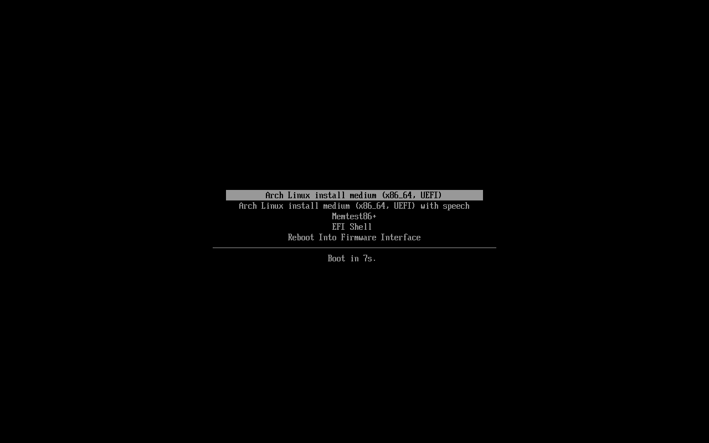

***

### 4. The installation itself

You are now in the live system, looking at a black console. Do not panic. This is the most uncomfortable moment of the whole installation and it lasts about ten minutes.

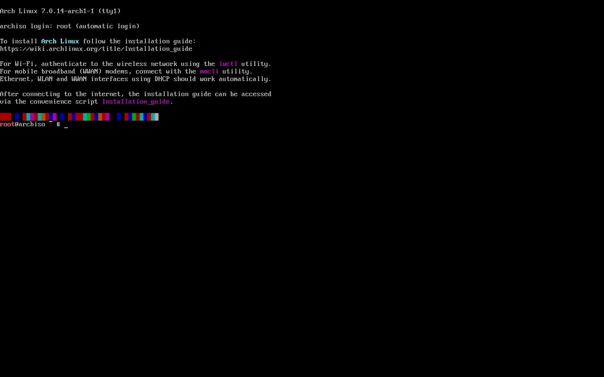

<details>
<summary><strong>Keyboard and internet first</strong></summary>

> Set your keyboard layout, otherwise typing your password turns into guesswork. For a German layout:
>
> ```bash
> loadkeys de
> ```
>
> On a cable you are already online. For Wi-Fi:
>
> ```bash
> iwctl
> station wlan0 get-networks
> station wlan0 connect YOUR_WIFI
> exit
> ```
>
> Check it with `ping -c3 archlinux.org`.

</details>

#### Starting archinstall

```bash
archinstall
```

This is the official installer. You move through a menu with the arrow keys, Enter selects, Esc goes back.

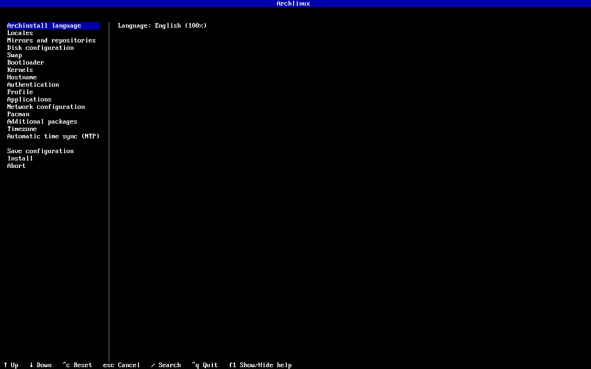

Out of all those entries, only these matter. You can leave the rest alone:

| Menu entry                      | What you want                                                          |
| ------------------------------- | ---------------------------------------------------------------------- |
| Disk configuration              | Your drive, filesystem `ext4` (see the warning below)                  |
| Bootloader                      | `Refind` (see below for why)                                           |
| Profile → Type                  | `Desktop`, then `KDE Plasma`, then `plasma-meta`                       |
| Profile → Graphics driver       | Your graphics card, `All open-source` if unsure                        |
| Profile → Greeter               | `plasma-login-manager`                                                  |
| Applications → Audio            | `pipewire` (defaults to "No audio server", which means no sound)       |
| Authentication → User account   | Create a user and answer the superuser question with `Yes`             |
| Network configuration           | `Use Network Manager (default backend)`                                |

<details>
<summary><strong>Drive and filesystem</strong></summary>

> Under "Disk configuration" pick "Partitioning" and then "Use a best-effort default partition layout". After that mark your drive with the space bar and confirm with Enter.
>
> 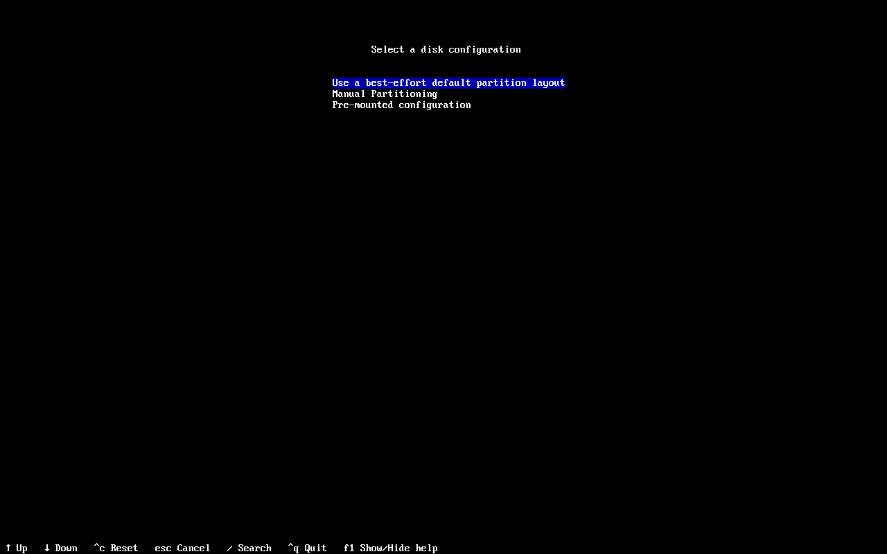
>
> For the filesystem you get `btrfs`, `ext4`, `xfs` and `f2fs`. Take `ext4`. It is the most boring one and that is exactly why it is right. `btrfs` can do snapshots, which is nice, but it wants to be understood first.
>
> archinstall then shows you its plan: a small `fat32` partition for `/boot` and the rest as `ext4` for `/`. Note the line `Wipe: True`.
>
> 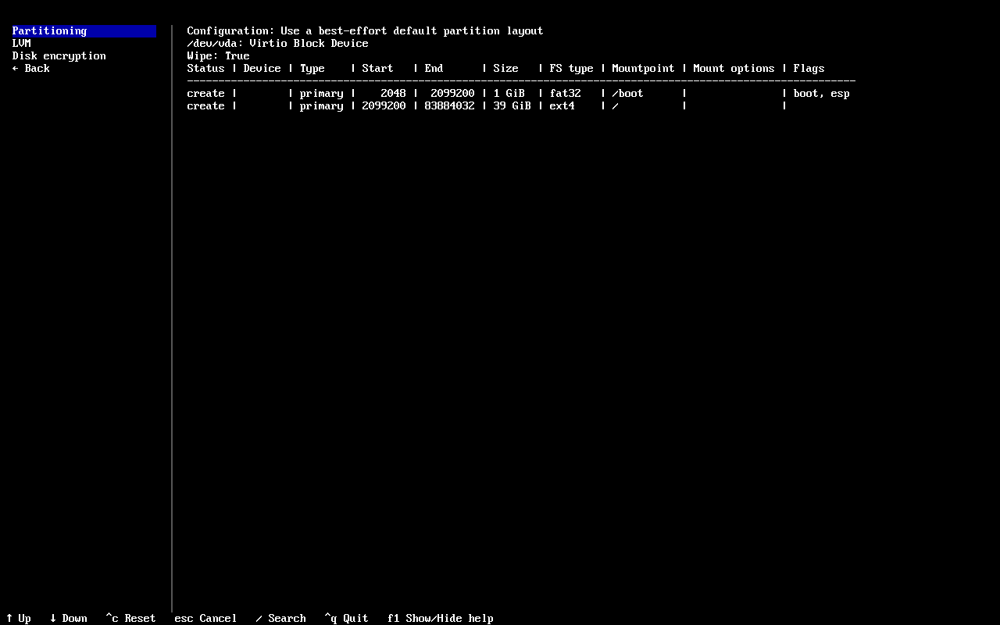

</details>

<details>
<summary><strong>Bootloader: take Refind</strong></summary>

> The installer offers five. `Systemd-boot` is preselected, we take `Refind`.
>
> 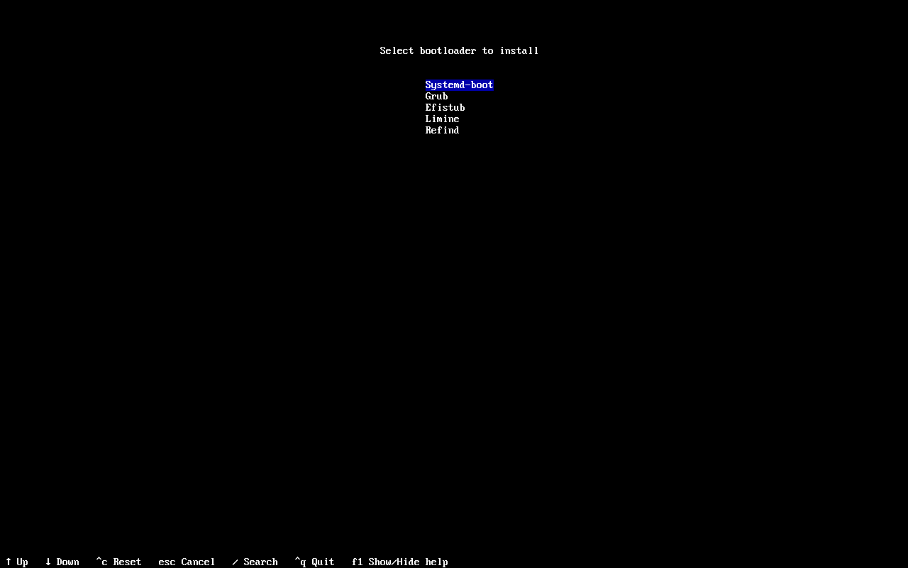
>
> Here is why: rEFInd looks for bootable systems by itself on every start. New kernels, an additional `linux-lts`, the fallback image and an existing Windows all show up in the menu on their own. You never have to rebuild a configuration the way you would with GRUB and `grub-mkconfig` after every kernel update.
>
> More on it in [chapter 5](#5-first-boot), including how to make it look nice.

</details>

<details>
<summary><strong>Desktop, drivers and sound</strong></summary>

> Under "Profile" pick `Desktop` at "Type", then `KDE Plasma` from the long list (mark it with the space bar) and after that `plasma-meta`.
>
> 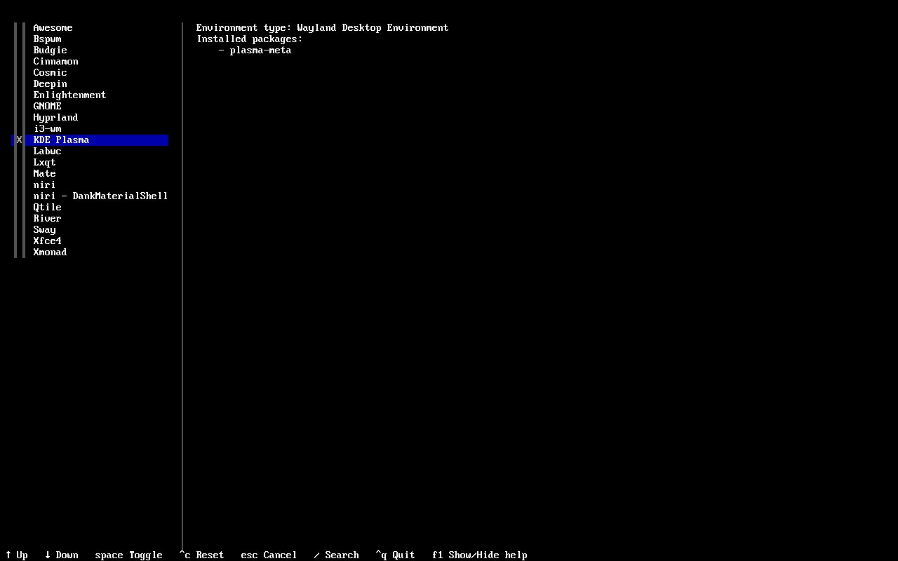
>
> "Graphics driver" sits in the same menu. Picking your card here saves you work later.
>
> 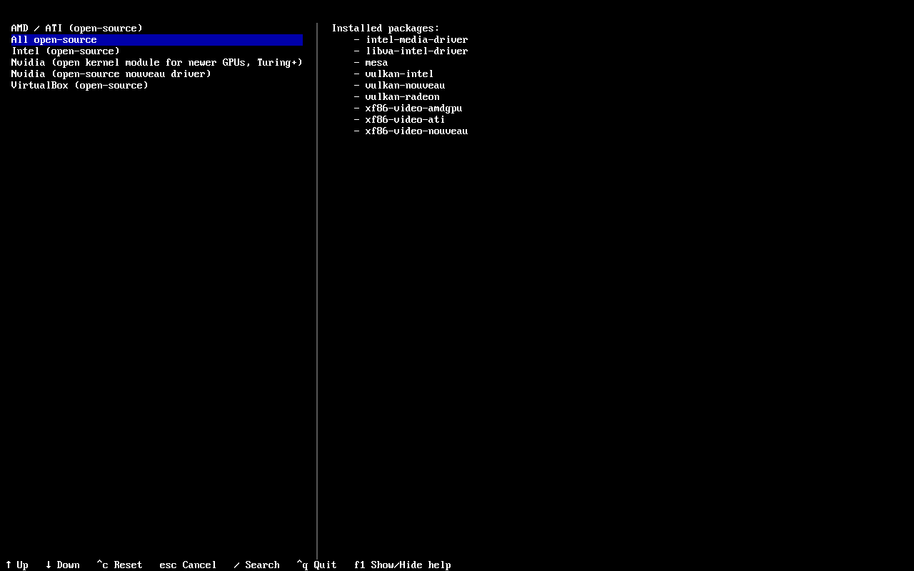
>
> Sound hides somewhere else, under "Applications" → "Audio". This is what it has to look like before you confirm with Enter:
>
> 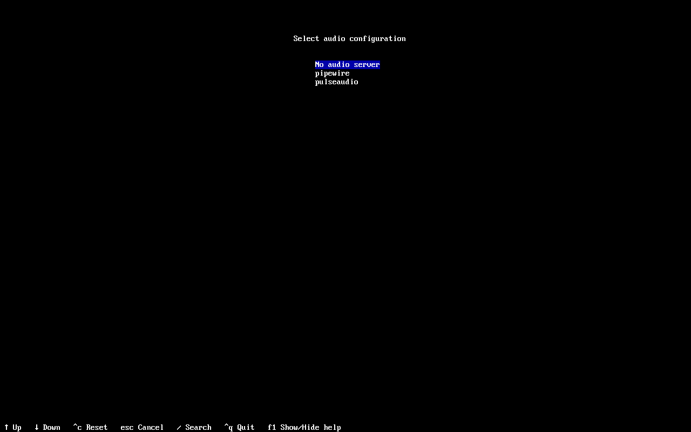
>
> **Watch out here:** when you open that menu, the bar sits one line higher on "No audio server". That is the default. So you actively have to move down once to `pipewire`. Anyone who just glances at it and clicks on ends up with a finished desktop and no sound, and then goes looking for the problem in their speakers.

</details>

<details>
<summary><strong>Creating a user</strong></summary>

> The entry is called "Authentication", below it "User account" and in there "Add a user". After name and password comes the most important question of the whole installation:
>
> 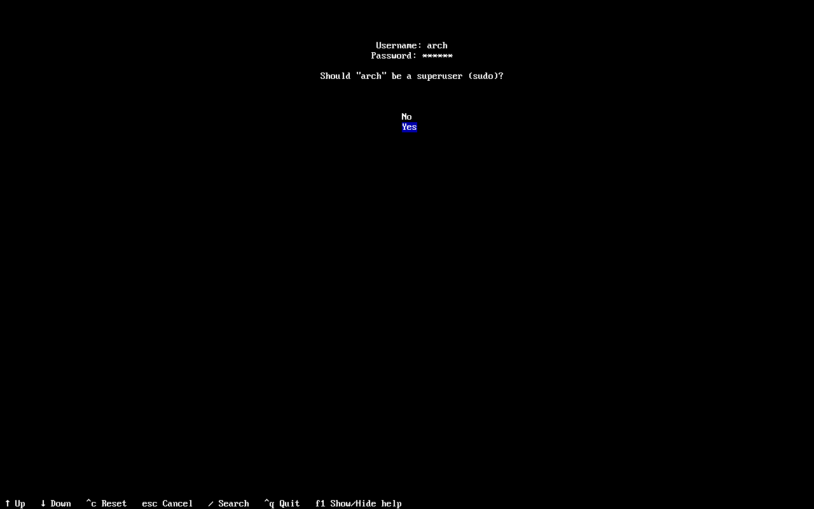
>
> This has to say `Yes`. Otherwise your user is not allowed to use `sudo` later and you cannot install anything. After that, "Confirm and exit".

</details>

> **Careful when picking the drive:** "Use a best-effort default partition layout" wipes the selected drive completely, which you can see from `Wipe: True`. If Windows is still on the machine and should stay, you must not take this. You need "Manual Partitioning" and free, unallocated space instead. More on that under [dual boot](#6-dual-boot-with-windows).

Once everything is set, choose "Install", confirm the summary with `Yes` and watch.

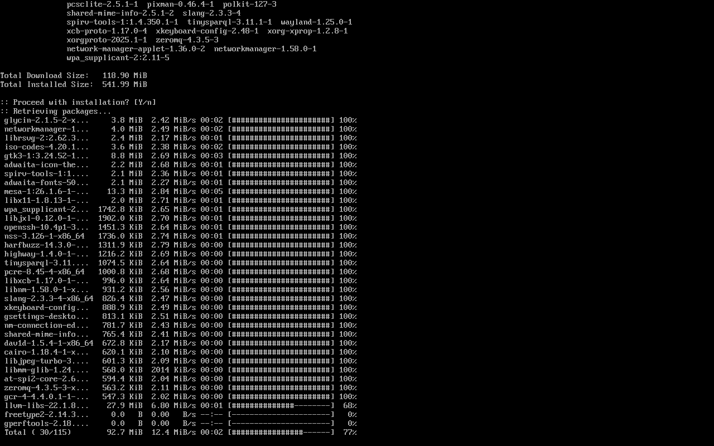

Depending on your connection and machine this takes a few minutes. In our test run it was just under three.

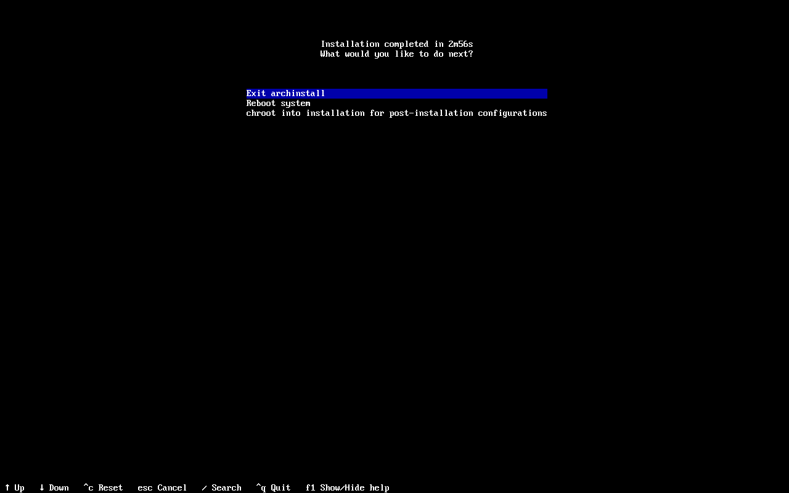

At the end you get three options: `Exit archinstall`, `Reboot system` and `chroot into installation for post-installation configurations`. You do not need the chroot, take `Reboot system`. Pull the stick out and you are done.

***

### 5. First boot

You land on the login screen, sign in with your user and you are in.

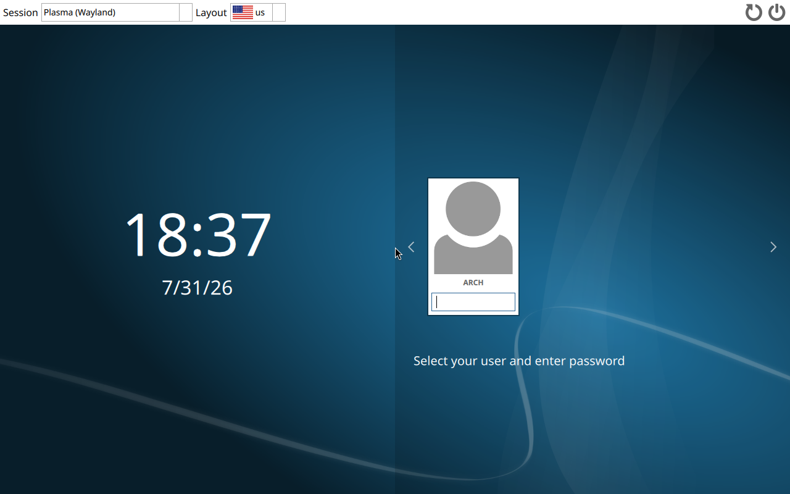

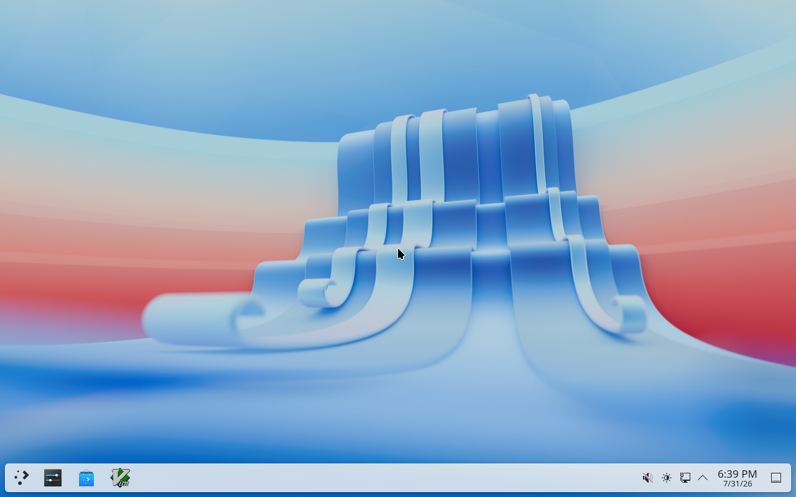

That is it. From here on it is a normal computer. The following things you do once and then never again.

<details>
<summary><strong>Network</strong></summary>

> If you picked `NetworkManager` in archinstall, everything is already there. You pick your Wi-Fi in the system tray at the top right of the panel.
>
> If the icon is missing:
>
> ```bash
> sudo pacman -S networkmanager plasma-nm
> sudo systemctl enable --now NetworkManager
> ```

</details>

<details>
<summary><strong>Install yay, and do it first</strong></summary>

> This is the most important step on this page. `yay` fetches official packages and the AUR with the same command, and the AUR is half the reason for running Arch. From here on we only use `yay` in this tutorial.
>
> ```bash
> sudo pacman -S --needed base-devel git
> git clone https://aur.archlinux.org/yay.git
> cd yay
> makepkg -si
> ```
>
> Up to this point it was `pacman` only, because `yay` did not exist yet. From now on you do not need it anymore. You can delete the `yay` folder.
>
> Installing from here on is `yay -S packagename`, without `sudo` in front. yay asks for your password itself when it needs one. More on that in [chapter 9](#9-keeping-an-eye-on-updates).

</details>

<details>
<summary><strong>Graphics drivers</strong></summary>

> If you already picked your card in the installer under "Profile" → "Graphics driver", this is done and you can skip ahead.
>
> If not: the open AMD and Intel drivers are already in the kernel, you only add the graphics libraries. You need the `lib32` packages for games and Wine, which requires `multilib` to be enabled in `/etc/pacman.conf`.
>
> AMD:
>
> ```bash
> yay -S mesa lib32-mesa vulkan-radeon lib32-vulkan-radeon
> ```
>
> Intel:
>
> ```bash
> yay -S mesa lib32-mesa vulkan-intel lib32-vulkan-intel
> ```
>
> NVIDIA is the one case where it gets a bit more fiddly. For anything from RTX 2000 on:
>
> ```bash
> yay -S nvidia-open-dkms nvidia-utils lib32-nvidia-utils
> ```
>
> On older cards you take `nvidia-dkms` instead of `nvidia-open-dkms`. Reboot once afterwards. Details are in the [wiki](https://wiki.archlinux.org/title/NVIDIA).

</details>

<details>
<summary><strong>Sound</strong></summary>

> With `pipewire` from the installer, sound normally works right away. If it does not:
>
> ```bash
> yay -S pipewire pipewire-pulse pipewire-alsa wireplumber
> ```
>
> Then log out and back in. You pick the output device by clicking the speaker icon in the panel.

</details>

#### The boot menu: rEFInd

[rEFInd](https://www.rodsbooks.com/refind/) is our recommendation for everyone, dual boot or not. It is a boot **manager**, not a bootloader in the classic sense: on every start it looks at your drives itself and builds the menu from what it finds.

In practice that means:

- **It finds kernel images on its own.** A new kernel, an additional `linux-lts`, the fallback initramfs, all of it just shows up. You never have to regenerate a configuration after an update the way you would with GRUB and `grub-mkconfig`.
- **It finds other systems on its own too**, Windows included. No `os-prober`, nothing to add by hand.
- It already looks decent without any work, and it can be rebuilt completely with themes.

**If you picked `Refind` as your bootloader in [chapter 4](#4-the-installation-itself), there is nothing left to do here.** It is already running, you saw it during the reboot:

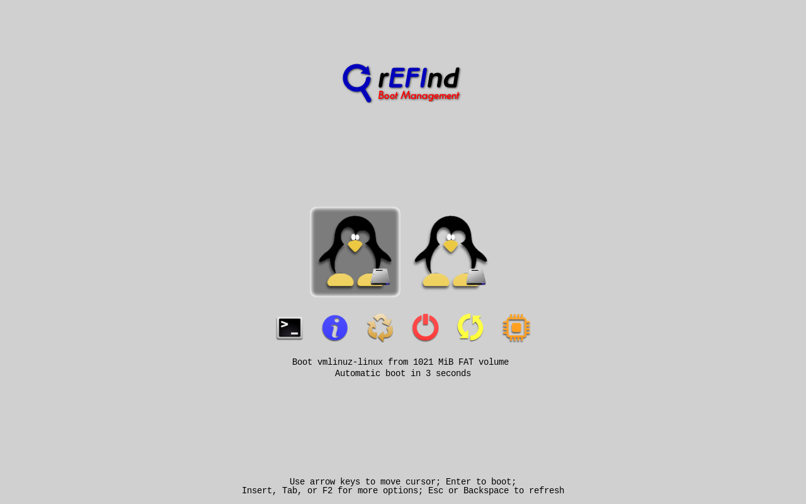

<details>
<summary><strong>Setting it up afterwards</strong></summary>

> Only needed if you took a different bootloader in the installer.
>
> ```bash
> yay -S refind
> sudo refind-install
> ```
>
> `refind-install` copies rEFInd onto the EFI partition and registers it as a boot entry. On the next restart you get the menu from above.
>
> If your motherboard is stubborn about the boot entry and rEFInd does not come up, this helps:
>
> ```bash
> sudo refind-install --usedefault /dev/sdXY
> ```
>
> `sdXY` is your EFI partition. You find it with `lsblk -f` (the small one with `vfat`, usually 300 to 1000 MB).

</details>

<details>
<summary><strong>Tidying up and making it pretty</strong></summary>

> The configuration lives in `/boot/EFI/refind/refind.conf` and is well commented. Two things people usually want early on:
>
> - `timeout 5` sets how long the menu stays up
> - `dont_scan_volumes` and `dont_scan_files` hide entries you do not need. rEFInd likes to find recovery partitions and similar things
>
> There are plenty of ready made themes to copy in. You hook them up with an `include` line in `refind.conf`.

</details>

<details>
<summary><strong>Honourable mention: GRUB</strong></summary>

> GRUB is what most guides on the internet use, and it is perfectly fine. It handles more special cases than rEFInd, for example exotic encryption and RAID setups, and you will find search results for every problem.
>
> The price is manual work: after changes you have to run `sudo grub-mkconfig -o /boot/grub/grub.cfg`, and for other operating systems you additionally need `os-prober`. For a normal Arch machine with KDE, rEFInd is simply the more modern tool by now and does everything you need.
>
> If you picked `grub` in archinstall and want to stay with it, just skip rEFInd. Nothing is broken about that.

</details>

***

### 6. Dual boot with Windows

Only relevant if Windows should stay on the machine. If you wiped everything anyway, skip this chapter.

<details>
<summary><strong>First: turn off Windows fast startup</strong></summary>

> This is the most important point in the whole chapter and the one most often forgotten. With "fast startup" Windows does not really shut down, it goes to sleep and leaves its drive marked as in use. Linux then refuses to write to it, or in the worst case you damage your files.
>
> In Windows: Control Panel, Power Options, "Choose what the power buttons do", then click "Change settings that are currently unavailable" and uncheck "Turn on fast startup".
>
> Turn off hibernation while you are at it, in a command prompt as administrator:
>
> ```
> powercfg /h off
> ```

</details>

<details>
<summary><strong>Opening the Windows drive under Linux</strong></summary>

> ```bash
> yay -S ntfs-3g
> lsblk -f
> ```
>
> `lsblk -f` shows all partitions with their filesystem. The big one with `ntfs` is your Windows drive. You can open it in Dolphin from the sidebar afterwards. To mount it automatically on every start you need an entry in [fstab](https://wiki.archlinux.org/title/Fstab).

</details>

<details>
<summary><strong>Getting Windows into the boot menu</strong></summary>

> If you set up rEFInd from [chapter 5](#5-first-boot): nothing at all. rEFInd finds Windows on the next start by itself and puts it next to Arch in the menu. That is exactly why we took it.
>
> Only if you stayed with GRUB is there manual work. You need `os-prober`, you have to set the line `GRUB_DISABLE_OS_PROBER=false` in `/etc/default/grub` and then run `sudo grub-mkconfig -o /boot/grub/grub.cfg`. If Windows does not appear in the output, the Windows EFI partition is not mounted right now.

</details>

<details>
<summary><strong>The clock is suddenly wrong</strong></summary>

> A classic: after switching between Linux and Windows the time is off by a few hours. The reason is that Linux sets the hardware clock to UTC and Windows reads it as local time.
>
> You should fix this on the Windows side, not the Linux side. In a command prompt as administrator:
>
> ```
> reg add "HKLM\SYSTEM\CurrentControlSet\Control\TimeZoneInformation" /v RealTimeIsUniversal /t REG_DWORD /d 1 /f
> ```

</details>

#### Secure Boot

With Secure Boot enabled, Arch will not start at first, because the bootloader has no signature your motherboard trusts. Two ways out.

<details>
<summary><strong>The easy way: turn it off</strong></summary>

> Into the BIOS (usually DEL or F2 while booting), under "Boot" or "Security" set Secure Boot to Disabled. Done.
>
> **Important beforehand if you keep Windows:** check in Windows under "Device encryption" or "BitLocker" whether your drive is encrypted. If it is, save the recovery key or suspend BitLocker first. BitLocker remembers the Secure Boot state, and if that changes, Windows asks for the 48 digit key on the next start. Without it you cannot get to your data anymore.

</details>

<details>
<summary><strong>The nice way: your own keys with sbctl</strong></summary>

> This keeps Secure Boot on and makes your machine trust your own Arch. It needs a BIOS that lets you clear the existing keys ("Setup Mode", often hidden behind "Clear Secure Boot Keys" or "Reset to Custom Mode").
>
> ```bash
> yay -S sbctl
> sudo sbctl status
> ```
>
> Once it says `Setup Mode: Enabled` you can start:
>
> ```bash
> sudo sbctl create-keys
> sudo sbctl enroll-keys -m
> ```
>
> The `-m` is mandatory for dual boot. It keeps the Microsoft keys, otherwise Windows will not start anymore. Some motherboards and graphics cards need them for themselves too, so leave it in even without Windows.
>
> Then sign what is involved in booting. With rEFInd that is the kernel and rEFInd itself:
>
> ```bash
> sudo sbctl sign -s /boot/vmlinuz-linux
> sudo sbctl sign -s /boot/EFI/refind/refind_x64.efi
> sudo sbctl verify
> ```
>
> `sbctl verify` lists what is still unsigned. So run it first and then sign exactly what it names. You do not have to worry about kernel updates afterwards, sbctl hooks into pacman and re-signs automatically. Finally turn Secure Boot back on in the BIOS.
>
> Full guide in the [wiki](https://wiki.archlinux.org/title/Unified_Extensible_Firmware_Interface/Secure_Boot#sbctl).

</details>

***

### 7. KDE the way you like it

This is the part that makes the whole effort worth it. KDE can be rebuilt beyond recognition, and all of it by clicking around in the system settings.

<details>
<summary><strong>Changing the look</strong></summary>

> System Settings, "Appearance & Style". Under "Colors & Themes" there is a "Get New" button at the bottom that pulls directly from the [KDE Store](https://store.kde.org/). The same exists separately for icons, cursors, window decorations and the login screen.
>
> If you take a full global theme, it changes colours, icons and panel all at once. You can always undo it, the default theme is called "Breeze".

</details>

<details>
<summary><strong>Panel and widgets</strong></summary>

> Right click the panel, "Add Widgets". Through "Get New Widgets" you end up in the store again. The panel itself can be moved, hidden or resized under "Configure Panel".
>
> One widget that is genuinely worth it on Arch is in [chapter 9](#9-keeping-an-eye-on-updates).

</details>

<details>
<summary><strong>You do not really need Flatpak</strong></summary>

> At its core Flatpak does the same thing as Discover: it downloads prebuilt packages that someone else compiled for everyone, and drags its own libraries along. That means bigger downloads, dependencies sitting on your disk twice and three times over, and a second update system next to `yay`. On Arch that is simply ballast, you have the AUR.
>
> There is exactly one case where it is still worth it: when a program is distributed as a Flatpak and nothing else. The best known example is Roblox. On Linux it runs through [Sober](https://sober.vinegarhq.org/), and Sober only exists as a Flatpak.
>
> ```bash
> yay -S flatpak
> flatpak remote-add --if-not-exists flathub https://dl.flathub.org/repo/flathub.flatpakrepo
> flatpak install flathub org.vinegarhq.Sober
> ```
>
> For everything else: try `yay -S name` first. If you find it there, take that.

</details>

***

### 8. Gaming

This works better than most people think. The majority of Windows games just start.

<details>
<summary><strong>Steam and Proton</strong></summary>

> Steam needs `multilib`. If you have not enabled it yet, uncomment the two lines at `[multilib]` in `/etc/pacman.conf`, then run `yay` once.
>
> ```bash
> yay -S steam
> ```
>
> In Steam under Settings, "Compatibility", tick both Steam Play boxes. That also runs games that officially do not support Linux. Whether yours is among them is on [ProtonDB](https://www.protondb.com/).
>
> If a game acts up, a different Proton version is worth a try. You get those comfortably with `yay -S protonup-qt`.

</details>

<details>
<summary><strong>Everything outside Steam</strong></summary>

> ```bash
> yay -S heroic-games-launcher-bin
> ```
>
> [Heroic](https://heroicgameslauncher.com/) is our recommendation. Epic, GOG and Amazon in one tidy interface, Proton version selectable per game, runs without fuss.
>
> [Lutris](https://lutris.net/) covers more special cases in return: old Windows games, emulators, Battle.net, and there are ready made install scripts for a lot of it. The interface is considerably more cluttered though. Take it as a second attempt when Heroic does not cover your game:
>
> ```bash
> yay -S lutris
> ```

</details>

<details>
<summary><strong>Useful extras</strong></summary>

> ```bash
> yay -S gamemode lib32-gamemode mangohud lib32-mangohud
> ```
>
> `gamemode` switches the machine to performance while you play, `mangohud` overlays FPS and load. In Steam you add it per game under launch options:
>
> ```
> gamemoderun mangohud %command%
> ```

</details>

> **The one catch:** games with kernel level anti cheat do not run, among them Valorant, League of Legends and Fortnite. This is not a missing setting, it is a decision by the publishers, and you will not change it. If one of those games is non negotiable for you, keep Windows as a dual boot (see [chapter 6](#6-dual-boot-with-windows)). Whether yours is affected is on [areweanticheatyet.com](https://areweanticheatyet.com/).

***

### 9. Keeping an eye on updates

Arch is a [rolling release](https://wiki.archlinux.org/title/Arch_Linux#Rolling_release). So there is no big version jump once a year where everything changes at once, but a steady stream of small updates. That sounds like more work at first, but in practice it is one command and a few minutes of waiting.

#### The one command you need

```bash
yay
```

One word, no arguments, no `sudo`. That updates official packages and the AUR in one go, asks for your password and is done afterwards. Once a week is plenty, and if you have not been at the PC for a while, you just do it then.

That is exactly why we set up `yay` so early in [chapter 5](#5-first-boot). With `pacman` alone you would have to update in two places and would quietly leave your AUR packages behind.

<details>
<summary><strong>What happens in the background</strong></summary>

> For the official packages `yay` calls `pacman -Syu` and then handles the AUR itself. The letters mean: `S` installs, `y` fetches the current package database, `u` brings all installed packages up to date.
>
> You do not need to know this to use Arch. It only helps when you google an error message some day and see `pacman` commands in other people's guides.

</details>

<details>
<summary><strong>Important: never use just "-Sy"</strong></summary>

> `yay -Sy packagename` (or `sudo pacman -Sy packagename`) looks harmless but is the most common way to break your Arch. It fetches the new package database but installs only a single package from it. That new package then expects libraries in versions that are not on your system yet. This is called a [partial upgrade](https://wiki.archlinux.org/title/System_maintenance#Partial_upgrades_are_unsupported) and Arch does not support it.
>
> Rule of thumb: the `y` never comes without the `u`. If you want a single package, use `yay -S packagename` without the `y`. And if someone on the internet writes a `-Sy` for you, just do a full `yay` instead.

</details>

***

#### Why the AUR makes the difference

The [AUR](https://wiki.archlinux.org/title/Arch_User_Repository) is the user maintained package collection next to the official repos, and honestly the reason Arch is worth it at all. It is not just that a lot of things live there that exist nowhere else. An AUR package is also not a finished program but a build recipe (`PKGBUILD`) that gets compiled on your machine. So you can build software for your setup instead of taking what someone else precompiled for everyone.

```bash
yay -S packagename   # installs, official repo or AUR, does not matter
yay -Qua             # shows only what has an update in the AUR
yay -Rns packagename # uninstalls including dependencies and configuration
```

> [paru](https://github.com/Morganamilo/paru) does basically the same and is just as fine. In this tutorial we stay with `yay` so the commands look the same everywhere.

***

#### Seeing updates without thinking about it

If you do not want to check yourself every time, there is a Plasma widget that shows pending updates right in the panel: [Arch Update Counter](https://github.com/bouteillerAlan/archupdate) by Bouteiller Alan. A small icon with a counter, and clicking it opens the list of pending packages with their version jumps.

<details>
<summary><strong>Installation</strong></summary>

```bash
yay -S plasma6-applets-arch-update-notifier
```

> `pacman-contrib` comes along as a dependency, which provides the `checkupdates` command. Also recommended are `yay` (for counting the AUR) and `konsole` (the terminal the update then runs in).
>
> After that, right click the panel, "Add Widgets", search for "Arch Update" and drag it in.

</details>

<details>
<summary><strong>How it counts</strong></summary>

> The commands are defaults in the widget's configuration and can be changed freely:

| Purpose        | Command                 |
| -------------- | ----------------------- |
| Official repos | `checkupdates \| wc -l` |
| AUR            | `yay -Qua \| wc -l`     |
| Run the update | `yay`                   |

> `checkupdates` is the clean way to do this. It downloads the package database into a temporary folder instead of `/var/lib/pacman`, so it does not do a `-Sy` on your system. You can let it count safely without accidentally catching a partial upgrade.

</details>

<details>
<summary><strong>What the widget does not do</strong></summary>

> The interface is only the display. The actual update starts through the configured command, and by default that is `yay` in a Konsole window. So in the end you still see a terminal asking for your password. We think that is right, during an update you want to see what happens.

</details>

***

#### The three things newcomers trip over

<details>
<summary><strong>1. Read the Arch news before bigger updates</strong></summary>

> A few times a year an update needs a manual step from you, for example when a package is renamed or a configuration moves. That gets announced beforehand on [archlinux.org/news](https://archlinux.org/news/). If an update is unusually large or `pacman` complains about a conflict, that is the first place to look.

</details>

<details>
<summary><strong>2. .pacnew files</strong></summary>

> If you edited a configuration file and the update brings a new default version, `pacman` does not overwrite your file. Instead it puts the new one next to it as `file.pacnew` and tells you at the end of its output.
>
> Ignoring that works fine for quite a while and then stops working. You clean it up with `pacdiff` (also from `pacman-contrib`), which shows you the differences and asks what should stay. More on it in the [wiki](https://wiki.archlinux.org/title/Pacman/Pacnew_and_Pacsave).

</details>

<details>
<summary><strong>3. Reboot after a kernel update</strong></summary>

> Once the kernel has been updated, the modules on disk no longer match the kernel you are running. Until you reboot, a freshly plugged in USB stick might not be recognised or a program might quit with a strange error. Your machine will not crash from it, a restart is simply due.

</details>

***

#### And what about Discover?

KDE ships [Discover](https://apps.kde.org/discover/), a graphical package manager that can show and install updates too. Completely without a terminal, if that is what you want. It is there anyway, because `plasma-meta` pulls it in automatically.

We would still advise against it:

- Discover ignores the AUR completely. So part of your packages just sits there without you noticing, and that part is the reason you installed Arch in the first place.
- When something goes wrong during an update, you get a short error message instead of the actual output from `pacman`. But that output is what you need for googling.
- It throws Flatpaks and system packages into the same pot, which is mostly confusing at the start.

Above all though: anyone who only clicks and only takes what arrives precompiled might as well stay on Windows. That already works pretty well over there. Arch only gets interesting once you use `yay` to fetch and build things that fit your machine.

And `yay` is three letters you memorise once and never look up again. That really is less effort than it looks.
